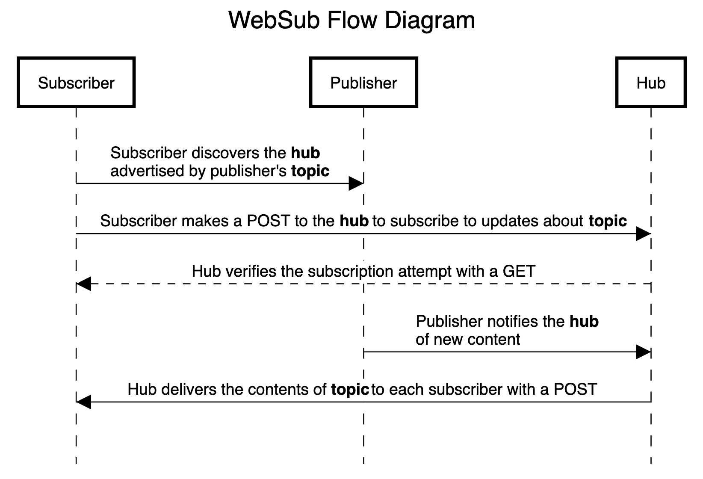

把對過去工作中對 Podcast 的理解記錄下來。

## RSS Feed

網路上的文章，就只是一個個散落在各處的網頁。讀者想看[財經 M 平方](https://www.macromicro.me/)，就要去他們的網站上看；想看[財報狗](https://statementdog.com/blog)，就要去財報狗的網站。當想追蹤的網站變多，獲取新文章內容就變得非常麻煩。於是有了 RSS、Atom 等標準，RSS 這類標準中最為廣泛使用的標準之一。

要使用 RSS 提供內容，內容創作者，就要產生一份 RSS 檔案，並放在網路上讓人獲取。例如 [https://www.macromicro.me/feed](https://www.macromicro.me/feed)、[https://blog.statementdog.com/blog/feed](https://blog.statementdog.com/blog/feed)。讀者會利用 RSS Reader 去幫忙自動獲取、彙整文章資訊，在 Reader 上閱讀多個網站的內容。

當我們去細看 RSS 內容，例如 [財經 M 平方的 RSS Feed](https://www.macromicro.me/feed)，會發現裡面除了標準的 RSS 2.0 tag 之外，還出現了 `dc:creator`、`atom:link` 這些其他標準的 tag。這是因為當初在制定 RSS 標準時，有些情境沒有考慮到，使用上產生一些問題。在實務上，大家就透過 xml namespace，在同一份檔案內，使用其他標準定義的 tag 來補強。

Podcast 被發明出來後，發明者選用 RSS 來發布內容，並在 iPod 上播放。接著 Apple 將 Podcast 納入 iTunes，讓 Apple 產品內建就支援 Podcast 功能。同時 Apple 針對 Podcast 定義了一些新的 tag，內容創作者發布的 RSS Feed 必須符合 Apple 要求。這個規範沿用至今，其他 Player 或多或少也都會照這這份規範開發。

到了 2020 年，最初的 Podcast 發明者跳出來成立了 [The Podcast Index](https://podcastindex.org/)。The Podcast Index 重點在於維持 Podcast 生態的獨立，不要讓大公司將開放的環境消滅。他們也訂定了一套新的 Tag（`podacst` namespace） 專門給 Podcast 使用，讓 Podcast 使用的 RSS 有共通的標準。最近查看 Apple 的[文件](https://help.apple.com/itc/podcasts_connect/#/itcb54353390)時，發現似乎 Apple 似乎開始有在參考這份標準了，這是個不錯的進展。

## 生態

這邊有個顯而易見的問題，規範這麼複雜，到處都是補丁，一般的內容創作者該怎麼產生 RSS Feed 呢？而且傳統的內容管理系統主要是管理文章內容，只會協助產生文章的 RSS Feed，一般創作者很難在上面添加 Podcast 所需要的內容。有些開發者發現了這個問題，針對 Podcast 製作了特殊的內容管理系統，稱作 Podcast Hosting。Hosting 除了解決內容發布的麻煩外，他們也會優化音檔的傳遞方式、降低維護成本、提升穩定度還處理其他瑣事。甚至針對不同的播放器提供不一樣的檔案格式，儘量讓聽眾以比較好的音質收聽內容。

這邊提到的 Hosting 在加上 Player、創作者、聽眾，構成了目前的 Podcast 生態。

## 廣告

有了 Hosting、Player，聽眾、節目的數量越來越多，商業行為當然會進入 Podcast 生態。慢慢開始有廠商願意在 Podcast 置入廣告，一般會要求創作者在節目中口說廣告內容，也就是口播廣告。雖然這是最傳統的方式，但到現在為止，還是最廣泛被使用的廣告方式之一。既然發現廣告有利可圖，廠商們自然而然地會在這方面做競爭。

首先，Hosting 結合了傳統的廣告代理商，協助媒合平台上的創作者、廣告案件。創作者依然是使用口播的方式置入廣告。因為口播廣告需大量的人工介入，很難一次性投放到很多節目內。所以當廠商有一筆廣告預算要消化時，不會去考慮小型節目，那會需要浪費大量溝通成本。這就演變成大節目可以持續地賺取廣告收入，同時也有大量的小型節目根本沒有廣告願意投放，但其實小型節目集結起來也有一定的流量。傳統口播廣告還有另一問題：置換廣告困難。有些廣告太久了，其實已經沒有多大意義，但因為是在錄製音檔時一起錄製的，所以他會一直留在音檔上，要置換會較麻煩。這也是一個可優化的地方。

為了解決口播廣告的問題，出現了自動化廣告插入的技術（DAI, Dynamic Ad Insertion）。DAI 不複雜，就是口播廣告的進化版本。廣告主錄製好音檔，Hosting 協助廣告主將廣告插入至創作者所指定的地方。廣告主只需要知道最終廣告是否有達到一定的曝光數量、最終的成效如何即可。因此，小節目也可賺取廣告收益。

有廣告，就會需要追蹤廣告成效。廣告主會需要知道曝光數、轉換率、聽眾輪廓。在一般的架構下，Hosting 能追蹤到的數據有限，只追蹤到聽眾下載音檔的行爲。音檔下載的時候，Hosting 可以知道聽眾的所在位置、收聽時間、下載次數。節目的播放數、聽眾輪廓則是 Player 端的數據。其中，下載數、播放數是最重要的兩個指標，類似於一般廣告的曝光數。

針對下載數的計算，[iab](iab.com) 制定了一套過濾、計算下載數據的[指引](https://iabtechlab.com/standards/podcast-measurement-guidelines/)。符合指引的公司，iab 會給予認證。但這邊必須注意的是，指引的內容，有些部分比較籠統，沒有限制作法，所以就算是兩個得到 iab 認證的公司，算出來的數據也有可能不同。要比較兩個節目的下載量，儘量用同一個平台所提供的數據，或是用第三方追蹤工具所提供的數據。例如 [Chartable](https://chartable.com/)。

Player 的播放次數與 Hosting 的下載數完全不同。Player 播放數是指聽眾實際在 Player 上收聽的次數。播放 N 次，不等同下載 N 次音檔。因為 Player 可能會預先下載，或是在第一次播放時暫存音檔，聽眾不管播放幾次，在暫存檔案刪掉前，都只算是一次下載。所以他們不能加總，加總後的數據不可靠，但實務上還是有可能會加總來看。主要是因為 Spotify 的流量不小，但是他又不照一般作法下載音檔，導致 Hosting 追蹤不到數據。

下圖是 Spotify 的做法，他會先將 Hosting 的檔案下載他們的系統中，由他們的系統提供音檔。既然收聽時不會經過 Hosting，那 Hosting 就追蹤不到數據。在中種情況下，Hosting 為了讓下載數不會因爲遺失 Spotify 數據，方便提供給廣告主參考。有些廠商就會將播放數、下載數混用。加總使用時，必須注意有幾個數據會失真。播放器佔比會失真，Spotify 使用量會被高估。節目下載數會失真，總數會被高估。

Spotify 不照一般方式運作其實可以理解。同時掌握 Player、音檔，可以投放更精準的廣告。不是單純的在音檔固定插入同樣的內容，而是針對不同的聽眾，插入不同的廣告，而且這樣的技術他們本來就用於他們的音樂串流服務上。串流影音的廣告插入技術不管是從 Server 端（SSAI, Server-Side Ad Insertion）還是 Client 端（CSAI, Client-side Ad Insertion）插入都很成熟。SSAI 類似 DAI，但搭配了 Player 上的使用者數據，讓成效更好。CSAI 可以做到互動廣告。這兩點 Hosting 都做不到。

## Index

在一開始的地方有提到 RSS Reader，其實 Podcast Player 跟 RSS Reader 做的事情很類似。不斷抓取 RSS Feed 內容，更新內容變更進 Database，最終呈現給使用者。抓資料進 Database 這個動作稱作 Index。

一般 Podcast Player、RSS Reader 會定時 Index 所有過時的 RSS Feed，確保 RSS Feed 更新後的一段時間內，讀者、聽眾可以看到最新內容。

在 Index 的過程中，需要解決一些問題：

1. RSS Feed 網址有可能改變。在網址改變後，但系統還會發現前，新的網址有可能會被 Index 進系統。這時就會發生網站、節目重複的問題。
2. RSS Feed 來源眾多，穩定度不高，可能偶爾就會壞掉。該如何處理這些錯誤。
3. 無法即時顯示內新內容。

### 重複節目

重複 RSS 的問題很難有個很好的解法，重複的情況勢必會發生，而且使用者會感受得到。像是在 Podcast App 內搜尋某個節目標題，結果出現兩個標題、封面一模一樣的節目。這種情況，可以在偵測到重複時，在系統內幫使用者訂閱正確的節目。又或者是跟 Apple Podcasts 做一樣的事情，上架節目需要驗證 RSS Feed，這也可以有效排除重複節目的情況。

### 錯誤

RSS Feed 是每個創作者提供的，他們可能使用 Hosting 平台，又或是自己架設伺服器提供 RSS Feed。當他們的服務出現問題時，我們會無法抓取節目內容。這種情況很容易發生，但通常是暫時性的。我們可以先短時間重是幾次（可能每隔幾分鐘試一次），問題持續存在話可以降低這個節目的更新頻率，最終甚至是暫停更新。避免阻塞我們的 Queue，減少資源浪費，增加效率。但 UI 上必須明確告知使用情況，要不然聽眾、創作者發現節目沒有更新，他們會很心急。（就是會來客服一直詢問狀況）

### 即時更新內容

RSS 流行後，許多人就意識到 RSS 存在無法即時顯示內容的問題。以 Podcast 來說，許多創作者會同時關注不同平台的發布狀況，當其中一些平台顯示新內容，但另一些沒有的時候，他們就會很警張。有時候聽眾也會有類似的狀況，他們會想說：「為什麼這個 Player 上面少了最新一集，是不是壞掉了？」。

所以有人就提了 [WebSub](https://www.w3.org/TR/websub/) 這個標準。當 Player 取得 RSS Feed 的時候，只要發現 RSS Feed 支援 WebSub，Player 就會使用 WebSub 接收即時的內容更新通知，收到通知後會即時的更新內容。這邊借 Spec 中的流程圖來用，看圖應該很好理解他的運作方式。

這邊 Hub 對應的一般會是一個第三方服務，不需要自行實作。最多人用的應該是 Google 的 [PubSubHubbub Hub](https://pubsubhubbub.appspot.com/)（以前 WebSub 叫做 PubSubHubbub）。

Subscriber 指的是 Podcast Player、RSS Reader，不是一般聽眾。Player、Reader 必須實作 [Discovery](https://www.w3.org/TR/websub/#x4-discovery)、[Subscribing and Unsubscribing](https://www.w3.org/TR/websub/#subscribing-and-unsubscribing)、[Content Distribution](https://www.w3.org/TR/websub/#x7-content-distribution) 的內容。訂閱的流程大致如下圖，實際上會需要再處理訂閱過期等情況。有趣的是，因為 WebSub 運作方式的關係，完全不用額外處理轉址的情況（節目轉換 Hosting 平台）。

## 數據追蹤、分析

數據的部分要分成兩塊，如同在前面廣告部分稍微提過的方式，區分成 Player 的數據、Hosting 的數據。Player 追蹤使用者輪廓、播放次數；Hosting 追蹤下載數、Player 佔比、OS 佔比。

Player 數據追蹤方式沒有什麼特別的，跟其他應用程式一樣，需要注意離線情況的數據追蹤。如果使用 Firebase analytics 的話其實連離線情況都不需要額外處理，Firebase SDK 都處理完了。

Hosting 比較特別，通常我們提供給 Player 音檔 URL 不會是直接連到音檔。而是會先連到追蹤數據的網址，之後再轉址到實際的音檔 URL。這樣的轉址可能不只一次，通常 Hosting 會追蹤數據，創作者還會再用 Chartable 或其他第三方追蹤服物追蹤一次數據。

Hosting 追蹤數據採用轉址的方式，是因為我們會將音檔放到 CDN 上，聽眾從 CDN 下載音檔收聽。這麽做可以節省成本、提升音檔下載速度。因此，聽眾收聽節目時，實際上不會經過 Hosting。為了要可以追蹤到數據，Hosting 才會多做一次轉址，讓聽眾一開始先連到 Hosting 的服務，之後才導向至 CDN。

在轉址的過程中，Hosting 會參考 iab 指引實作資料過濾等機制。但有個問題，iab 提供的部分建議作法做不到，像是濾掉下載太少資料的請求。這是因為追蹤數據的地方不是實際提供音檔的地方，無法得知音檔下載進度等情況。導致各家 Hosting 資料過濾機制都有些微差異。

追蹤方式的不同，正是第三方追蹤工具被廣泛使用的原因。假設有一位廣告主想投放廣告，他有兩個報價相同的選項，節目 A、B，這兩個節目放在不同的 Hosting 平台。廣告主想選擇流量較好的節目投放，但 Hosting 平台之間數據可能不太相同，根本無法比較。這時候如果兩個節目都有使用共同的第三方數據追蹤工具，廣告主就可以參考這個第三方數據來做判斷。

## 對 Podcast 產業的想法

有人說，Podcast 的問題在聽眾很難找尋到新節目，所以很難成長。但我不覺得，這個問題其實主流 Player 很好解決，只是有沒有想要做的問題而已。當資料庫內已經 Index 好大量節目，又掌握了使用者的收聽偏好，有可能會無法推薦使用者感興趣的節目？我認為問題是有沒有足夠的誘因吸引 Player 優化這部分使用體驗。

比較直得注意的是，Podcast 生態在慢慢改變。主流 Player 越來越重視 Podcast 市場，功能越來越來完善，現在開始會跟 Hosting 搶廣告這塊餅，而且還佔有優勢。Spotify 甚至直接在搶 Hosting 的市場。在未來，我覺得主流 Player 都會走向 Spotify 的模式。大部分的 Hosting 會因為無利可圖而消失，但 Hosting 這個角色不會消失。剩下的應該會是跟主流 Player 深入合作的 Hosting，或者是大型媒體公司自己的 Hosting，甚至就是 Player 廠商自己提供的 Hosting 平台。那為什麼我認為 Hosting 不會完全消失？因為我不認為有任何一個 Player 可以壟斷市場。有多個 Player 的情況下，創作者就必須持續提供內容給各個 Player。而負責提供內容給 Player 的工具，就是 Hosting。

另外還有一群比較有理想的人，認為 Podcast 本來就是自由、開放的傳播媒介，不希望讓大型公司決定我們能接收、看到什麼樣的內容。他們的做法是建立一個開放的 Index，也就是 [The Podcast Index](https://podcastindex.org/)。有了 Index，我們就可以輕易地呈現 Podcast 內容給聽眾，不會受中心化的公司控制。很有趣的組織，會想持續追蹤他們的狀況，雖然他們不太可能對 Podcast 產業、生態造成太多影響。

## 補充

### Podcast RSS Feed 的規範、指引

這三個是必須要遵守的規範、指引，大部分 Player 也都只參考他們所定義的內容。

- [RSS 2.0](https://www.rssboard.org/rss-profile)
- [Apple Podcasts](https://help.apple.com/itc/podcasts_connect/#/itcb54353390)
- [Google Podcasts](https://support.google.com/podcast-publishers/answer/9889544?hl=en)

下兩個是可自己選擇要不要參考的規範。一般來說我們會使用 `dc:creator`，而不是 RSS 2.0 的 `author` 來表示 item 的創作者。主要是因為很多情況下，我們不想（或是無法）提供 email address，但 `author` 要求要提供 email，所以大轉而使用 `dc:creator` 來表示創作者。

- [Dublin Core](https://www.dublincore.org/specifications/dublin-core/dc-xml-guidelines/)
- [Podcast Namespace](https://podcasting2.org/podcast-namespace)

### 常用工具

- [Podbase Podcast Validator](https://podba.se/validate/)
- [Cast Feed Validator](https://castfeedvalidator.com/)

### 音檔串流

- [認識音檔](https://zonble.github.io/understanding_audio_files) (跟 Podcast 比較有關的是 MP3、HLS、MPEG-DASH)
- [Combining dynamic ad insertion and A/B watermarking](https://aws.amazon.com/tw/blogs/media/combining-dynamic-ad-insertion-and-a-b-watermarking/)
- [CSAI vs SSAI: Client-Side Ad Insertion and Server-Side Ad Insertion Explained](https://bitmovin.com/csai-vs-ssai-client-side-server-side-ad-insertion)
