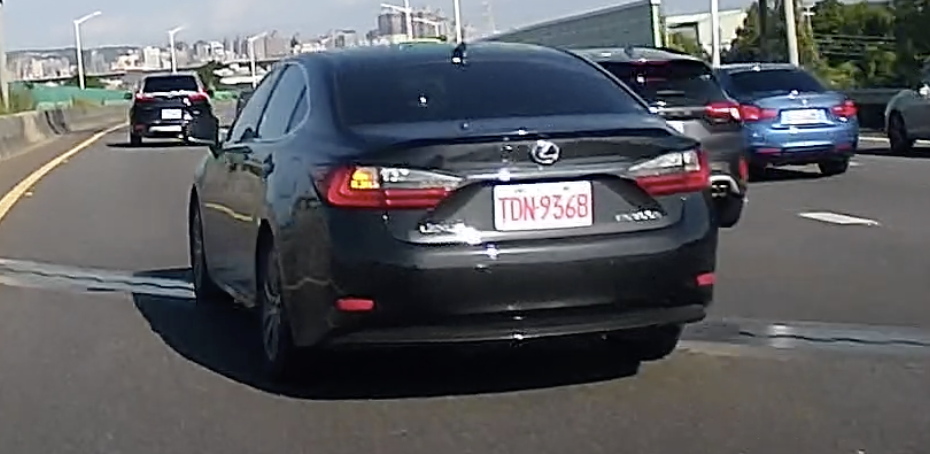
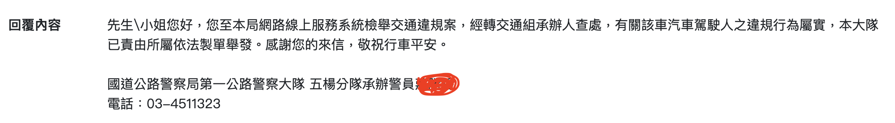

之前住在捷運共構，停車場的車道出入口經常發生違停情況，這使得我進出停車場時視線經常被阻擋，非常危險。在無法忍受的情況下，我開始了解如何檢舉違規行為，後來我加入了一些 Facebook 社團，發現有些被檢舉的人會到這些社團來討拍，他們的邏輯很奇特，因此有時候閱讀這些社團的文章也變成了一種娛樂。

這這裡記錄一下檢舉時的一些要點，最後有一個範例。

## 法規

什麼情況可以檢舉、會有什麼處罰都是「[道路交通管理處罰條例](https://law.moj.gov.tw/LawClass/LawAll.aspx?pcode=K0040012)」所規範的。其中 [7-1 條](https://law.moj.gov.tw/LawClass/LawSingle.aspx?pcode=K0040012&flno=7-1) 說明了哪些情況我們可以檢舉。我覺得直接讀 7-1 條有點累，如果路上遇到你覺得不應該發生的事情，建議可以直接下關鍵字搜尋網頁，例如在網頁中搜尋「超車」，就可以查到 [92 條](https://law.moj.gov.tw/LawClass/LawSingle.aspx?pcode=K0040012&flno=92) 有相關規定，再搜尋「九十二」（沒錯要用國字的數字）搜尋，確認是否有出現在 [7-1 條](https://law.moj.gov.tw/LawClass/LawSingle.aspx?pcode=K0040012&flno=7-1)，有的話就可以檢舉。

### 對於法規常見的問題

* __併排停車__：認定標準請參考[監理法規檢索系統](https://www.mvdis.gov.tw/webMvdisLaw/SorderContent.aspx?SoID=16195&Numb=1085007741&Conj1=AND&Conj2=AND&ShowType=ArticleSearch)，附件中有圖示，觀看圖示可方便理解。
* __違規停車__：有問題的會是白線停車的情況，白線分 15 公分、10 公分，10 公分是慢車道分隔線不可停，15 公分可停，但車子不可壓線也不可佔據到部分車道。（[	道路交通標誌標線號誌設置規則](https://law.moj.gov.tw/LawClass/LawAll.aspx?pcode=K0040014)）

## 注意事項

* 照片、影片上如果沒有時間是不會舉發的，建議是直接用行車記錄器的影像檢舉，如果用手機拍攝的話，建議下載「時間相機」（Google 就可以找到了）。
* 請特別將車牌部分截圖出來，避免因檢舉系統壓縮影像造成承辦員警無法辨認車牌號碼。
* 如果影像中違規的情況較不明顯，建議截圖特別標注起來，以免承辦員警疏忽。
* 同一個動作如果違反多個條文可以分別檢舉。
* 各地檢舉系統的檔案大小限制不同，建議影片去除音訊且不要太長。

## 真實身份會洩漏嗎？

有些違規仔會查監視器畫面，透過檢舉的時間點、拍照的角度去反推可能的檢舉人是誰。另外就是我們檢舉的時候都會留個人資料，如果不慎外洩，也會被知道身份，擔心的話就不要檢舉了。

## 違規項目民眾不能檢舉怎麼辦？

如果不是可檢舉的項目，但確實有違規情形發生，可以直接報案請警察處理。

* 警政署的「110視訊報案」App（請到 App Store 下載）
* [手機簡訊報案](https://www.npa.gov.tw/ch/app/artwebsite/view?module=artwebsite&id=808&serno=d08673f4-0775-4a09-b4d8-d47c2c4edca2)

## 檢舉系統

每個縣市都有自己的檢舉系統，直接 Google 找就可以了，國道的話有國道的檢舉系統。

## 範例

9/10 遇到一台多元計程車，切換車道沒有提前打燈，也沒保持安全距離。這應該會符合[第 43 條](https://law.moj.gov.tw/LawClass/LawSingle.aspx?pcode=K0040012&flno=43)中所說的「__任意以迫近、驟然變換車道或其他不當方式，迫使他車讓道。__」，會處「__臺幣六千元以上三萬六千元以下罰鍰__」，這是相當重的一條。

因為是在國道上，所以我會去[國道公路警察局](https://wos.hpb.gov.tw/RV)網站檢舉，違規項目選擇「危險駕駛、逼車」，違規事實選擇「任意以迫近、驟然變換車道或其他不當方式，迫使他車讓道」。

我提供了兩個附件，一張清晰的車牌照片，一段完整的違規影片。

`vimeo: https://vimeo.com/863225188`

實際回覆：

